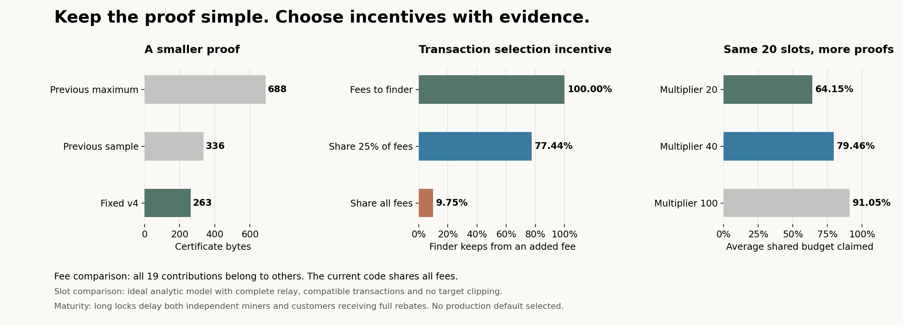

# Smaller proof and reward design choices

The author now requires contributions to remain useful after subsidy ends.
A positive fee allocation is therefore required; all fees to the finder is only
a comparison control. The newer [operator comparison](OPERATOR_COMPARISON.md)
supersedes the recommendations below where they conflict.

25 September 2026. Version 4 is implemented. Fee and maturity alternatives in
this document are comparisons, not additional consensus settings.

The immediate recommendation is to keep the new fixed proof, compare two fee
policies directly, and leave the production parameters open. The year lock is
not justified as a default by the evidence we have. There is no need for the
proposal author to guess a supposedly optimal number.

## What changed in the implementation

| Element | Earlier format | Version 4 |
| --- | --- | --- |
| Certificate | 336 byte sample, 688 byte maximum | Fixed 263 bytes |
| Binding | Imported SHA state and source Merkle evidence | Tagged hash of X and keys in inherited BLAKE2b header |
| Maximum evidence body | 13,111 bytes | 4,998 bytes |
| Maximum carrier outputs | 183 | 70 |
| Coinbase OP_RETURN limit | 83 bytes per script | 83 bytes per script |
| Historical SHA contribution mining | Supported by added code | Removed; inherited SHA blocks unchanged |
| Upstream SHA implementation changes | Imported state access | None |

The fixed proof is about 22% smaller than the earlier sample and 62% smaller
than its maximum. The main simplification is removing a cryptographic
construction and variable source evidence, not merely saving bytes.

The header field is committed by existing BLAKE2b work. Directly using it means
that contributed work cannot also carry an unrelated merge mining commitment
in that field. Source block validity remains outside the certificate's claim.
The settling block still validates X. This choice introduces no extra chain,
work weight, proof signature, funding transaction or deployment activation.

## Fee rules compared on equal terms

All three cases retain twenty slots, the same 5% inclusion skim, and identical
reward scripts and maturity. The finder directly receives any fee portion not
assigned to the shared budget. This direct portion still uses the allocation
scripts in the comparison; it is not an exemption from maturity.

| Fee policy | Finder keeps from an added 400,000 sat fee, with 19 foreign contributions | Contribution recipients receive | Main tradeoff |
| --- | ---: | ---: | --- |
| All fees to finder; share subsidy | 400,000 | 0 | Preserves the finder's fee incentive; contribution funding vanishes with subsidy |
| Share one quarter of fees | 309,750 | 90,250 | Retains some fee funding but adds a split parameter and still dilutes marginal fees |
| Share all fees; current code | 39,000 | 361,000 | Funds contributions after subsidy ends, but strongly dilutes the finder's marginal fees |

The remaining subsidy allocation is identical across these examples. All slots
are filled here, so no part of the added fee is unclaimed. With empty slots,
shared fees can be unclaimed too. For example, with zero contributions the
current rule pays the finder 20,000 of an added 400,000 sat fee and leaves
380,000 unclaimed. The finder fee policy pays all 400,000 to the finder.

If the finder owns contribution recipients, its total return includes those
allocations too. At full slots this can favor its own qualifying inventory.
The numbers above deliberately hold ownership foreign to expose that incentive.
An inclusion decision also has to account for block space, X dependencies,
conflicts and the rewards displaced by replacement.

An ordinary transaction paying a finder directly can avoid sharing that
compensation and the proposed coinbase locks. No fee policy here prevents all
such arrangements. Giving the finder all fees removes the additional dilution
caused by fee sharing; it does not eliminate side payments or financing costs.

**Recommendation:** use all fees to the finder as the primary alternative to
the current combined reward rule. It is the clearer baseline for transaction
selection incentives and needs no new fractional fee parameter. Do not adopt
it as the final rule without accepting its loss of contribution rewards as
subsidy approaches zero. Keep the quarter sharing case as a sensitivity check,
not a third proposed consensus knob. The current implementation is unchanged
so this comparison can be reviewed before changing reward policy.

The arithmetic uses real satoshi rounding: shared budget is subsidy plus the
rounded shared fee fraction; slot is floor(shared budget / 20); skim is
floor(slot / 20). Every unshared fee sat goes to the finder allocation. The
comparison script checks 3,840 integer allocations, including zero subsidy,
tiny rewards and maximum money boundaries. Only the currently implemented fee
policy has also been exercised through native block validation in this update.

## Slots and proof frequency are different controls

The slot count limits how many contributions a block can pay across the whole
network, not per miner. A small miner still needs enough of the total hashrate
to find qualifying work; twenty slots does not promise them regular receipts. The target
multiplier controls how often qualifying proofs appear. Increasing both
proportionally does not solve empty slots: blocks still arrive unpredictably.

For C total slots and combined target multiplier M, in the ideal unclipped
model the weak count N before a block is geometric, and

$$
E[\text{claimed shared fraction}] = \frac{1}{C}\sum_{k=0}^{C-1}(1-1/M)^k.
$$

| Reference case | Average weak proofs per block interval | Average shared budget claimed | All 19 slots filled |
| --- | ---: | ---: | ---: |
| 20 slots, multiplier 20 | 19 | 64.15% | 37.74% |
| 20 slots, multiplier 40 | 39 | 79.46% | 61.81% |
| 20 slots, multiplier 100 | 99 | 91.05% | 82.62% |

These are analytic benchmarks for constant rewards, independent work,
instantaneous complete relay, compatible Xs and no target clipping. The ideal
model uses a full solution probability of 1/M among qualifying results,
neglecting single hash endpoint differences in the integer target. They are
not measurements from the regtest chain or predictions of adoption. Easy
regtest targets clip the multiplier, so an acceptance test cannot validate
these economics. Work made more frequent by an easier target is not additional
physical hashrate or extra chainwork.

The sweep also covers 5, 10 and 40 total slots at proportionate multipliers.
Each extra slot adds another possible recipient and another certificate.
Increasing M while holding C fixed keeps the maximum evidence size unchanged,
but increases relay traffic, unused proof inventory and selection pressure.
No finite multiplier makes every block fill: an immediate full block can still
arrive before any weak result. Unclaimed rewards reduce issuance and miner
revenue; they are not transferred to miners who run nodes. Any effect on the
network security budget needs separate economic evaluation.

**Recommendation:** keep 19 contributions plus the finder, with multiplier 20,
as the reproducible control. Use multiplier 40 as the first competing case.
Do not optimize solely for 0% unclaimed rewards. Before selecting a default,
measure per miner realized revenue and variance, selection bias, delivery loss
and resource use with realistic hashpower and fees. Running a node does not
create a missing proof or guarantee its inclusion.

## Maturity is a financing choice

The contribution's two keys identify recipients, not the owners or locations
of nodes. Both allocations can pay the same miner whether they run a node or
use a service. A service returning both portions has the same consensus locks.

| Schedule compared | New relative delays | Purpose |
| --- | --- | --- |
| Inherited baseline | No added delay beyond the 100 block baseline | Isolate the contribution mechanism's economics |
| Short comparison | 100 and 1,008 blocks | Measure a modest asymmetric delay |
| Current control | 6,480 and 52,560 blocks | Measure the earlier long lock proposal |

Inherited temporary longer coinbase restrictions still apply to every case.
The model's normal 100 block baseline is not a promise that all inherited
coinbases are spendable at 100 under every height configuration. The source
retains the current control, with a 50/50 allocation split.

At an illustrative 10% annual discount rate and ten minute blocks, the current
control loses about 5.1% of present value relative to the normal 100 block
baseline. The loss applies to independent miners and customers receiving the
same reward schedule. The rate is an assumption, not a market financing quote.
Maturity in consensus remains a number of blocks rather than calendar time.

**Recommendation:** do not freeze the year lock into a recommended protocol.
Use inherited maturity as the baseline, then require a demonstrated benefit
before adding delays. Changing the split cannot distinguish two otherwise
identical payment arrangements. A larger financing burden is not evidence of
an economic advantage for running a node.

## What this settles and what remains

We have reduced the proof surface and made the fee alternatives explicit.
We have a small, reproducible parameter comparison instead of unexplained
magic numbers. We have not established a universally superior parameter set
or completed a live adoption trial.

The next economic test should compare the finder fee alternative with the
current combined policy at both multipliers, holding operator costs and
payment schedules constant. Include owned versus foreign inventory, direct
payments, withholding and realistic delivery. Report when each arrangement
loses as well as when it wins. Independently review the fixed commitment and
run physical ASICs before a public testnet or deployment recommendation.

Reproduce with `compare_fee_rules.py --output PATH`. Raw comparison data and
this figure's rendering script are in [v4/](v4/). Native validation results are
listed separately in [VALIDATION.md](VALIDATION.md).
