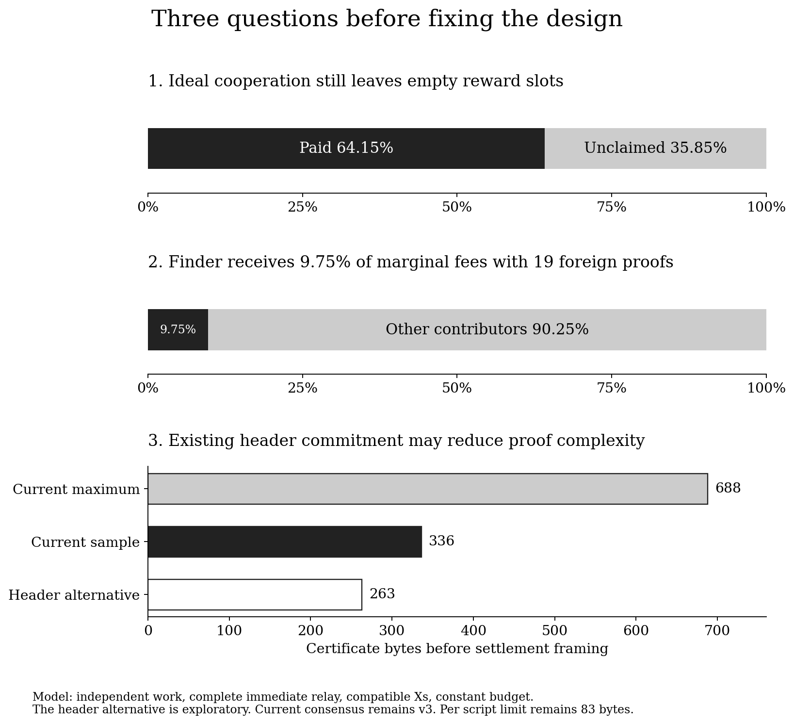

# Review of the mechanism and its objective

Historical v3 review. The smaller proof is now implemented in v4; see
[DESIGN_CHOICES.md](DESIGN_CHOICES.md) and [SPECIFICATION.md](SPECIFICATION.md).
The findings and evidence below refer to the earlier format.

25 September 2026. This review evaluates proposal commit
`93e1f3cf27297925637073c65aea49a5e3b2a97d`. The new experiments do not change
the consensus rules or select new parameters.

The implementation demonstrates a useful conditional rule: crediting a share
requires including X and paying its committed recipients. The stronger goal,
making independent node operation economically preferable, does not follow
from that rule. The most consequential remaining work is therefore design
evaluation as well as software hardening.

## Findings ranked by consequence

| Finding | Evidence | Consequence |
| --- | --- | --- |
| Delegated service can reproduce the same payment schedule | Same keys, work and outputs can be chosen by either operator | Split and maturity alone cannot establish a strict preference for self operation |
| Empty slots occur even with ideal cooperation | Analytic geometric model, independent sum and one million simulated intervals | Unclaimed rewards are not a reliable measure of censorship or failure to run nodes |
| Sharing fees dilutes the finder's marginal fee revenue | Exact formula and native block validation at four contribution counts | Direct payments and preference for owned contributions need adversarial economic analysis |
| Long locks constrain independent miners too | Same scripts and illustrative present value calculation | Financing costs can favor well capitalized services; longer locks are not a one sided penalty |
| Current commitment may be unnecessarily complex for BLAKE2b | Native hook experiment accepted on all four profiles by candidate and parent | Investigate replacing imported SHA state and source Merkle evidence before freezing v3 |
| Existing tests establish narrower claims than deployment safety | Private loopback, easy work, fixed fixtures and known keys | Public networking, hardware, fuzz coverage and strategy testing remain separate gates |

## 1. What the protocol can actually distinguish

Consider two arrangements with identical hashrate, transaction X, reward keys,
delivery timing and payment schedule. In one, the miner operates the node. In
the other, a service operates it and returns both allocations to those keys.
Every input to consensus can be identical. Any consensus rule over those
inputs must treat both arrangements identically.

The miner can still prefer operating a node because of control, service fees,
privacy, availability or trust. Those are real reasons, but they depend on
costs and preferences. Conversely, a service can distribute its operating cost
across many customers. Neither a low fee nor a full rebate requires malicious
intent. This is a structural counterexample to universal economic superiority,
not a missing implementation test.

The minimum enforceable statement remains: if my proof is credited, my X is
included and my recipients are paid. A finder retains discretion to omit the
proof. In particular, full slots, incompatible transactions and its existing
inventory of owned proofs affect the cost of exclusion.

## 2. Why the nominal share count does not fill the slots

Assume independent work, no target clipping, complete immediate relay,
compatible Xs and a constant reward budget divisible by twenty. Each qualifying
result is a full block with probability 1/20. Let N be the number of weak
results before that block. Then

$$
\Pr[N=n]=\frac1{20}\left(\frac{19}{20}\right)^n,
\qquad E[N]=19,\qquad \operatorname{Var}(N)=380.
$$

The number actually credited is min(N,19), not E[N]. Short intervals leave
slots empty; long intervals cannot carry their excess into another block.
Using the tail sum for a capped count gives

$$
E\left[\frac{1+\min(N,19)}{20}\right]
=1-\left(\frac{19}{20}\right)^{20}
\approx 0.641514.
$$

Thus the ideal benchmark leaves **35.85% unclaimed** and fills all nineteen
contribution slots in only **37.74%** of intervals. A seeded simulation of one
million intervals produced 64.1425% claimed, within its sampling uncertainty
of the analytic 64.1514%. This is an analysis of the proposed rules, not live
network data or a forecast of price or hashrate.

Changing pools cannot recover slots for shares that never existed. Better
delivery can reduce additional losses, but cannot remove this intrinsic
benchmark. This does not mean zero unclaimed reward should become the goal.
It means the size and incidence of the reduction must be an explicit choice.

Keeping twenty slots while changing the target multiplier illustrates the
tradeoff:

| Effective multiplier | Ideal average paid | All slots filled |
| --- | ---: | ---: |
| 10 | 43.92% | 13.51% |
| 20 | 64.15% | 37.74% |
| 40 | 79.46% | 61.81% |
| 100 | 91.05% | 82.62% |

More frequent qualifying work increases delivery and selection pressure and
reduces the work required per proof. It does not increase physical hashrate.
When the weak target clips at the largest hash value, the effective multiplier
is lower than its nominal value. Easy regtest acceptance tests therefore do
not reproduce production reward economics.

## 3. Fees create a second incentive problem

For n credited contributions, the finder receives S+n*k, where S is the
budget divided by twenty and k is S divided by twenty, both rounded down.
Away from rounding boundaries, its share of an added fee is

$$
\frac1{20}+\frac{n}{400}.
$$

If the contributions belong to other parties, that ranges from 5% to 9.75%.
For an additional 400,000 sats of transaction fees, the native experiment
confirmed:

| Contributions | Finder | Contributors | Unclaimed |
| --- | ---: | ---: | ---: |
| 0 | 20,000 | 0 | 380,000 |
| 1 | 21,000 | 19,000 | 360,000 |
| 10 | 30,000 | 190,000 | 180,000 |
| 19 | 39,000 | 361,000 | 0 |

The fixture checks the allocations by role; the economic interpretation as
foreign rewards assumes the finder does not own those recipients. If it does,
its total proceeds are larger. This gives an owned contribution another
advantage over a foreign one when competing for a slot.

A payment directly to a finder's existing wallet can avoid redistributing the
payment as a transaction fee. An ordinary transaction output is also outside
these proposed coinbase CSV locks. This cannot evade the subsidy restrictions,
but it can route service or inclusion compensation around fee sharing and its
locks. Reliably arranging that payment has coordination and trust costs, so
the calculation is an incentive concern, not a claim that every fee will move.

Compare at least two designs before selecting the basis: sharing subsidy only
while leaving fees to the finder, and sharing subsidy plus fees as currently
implemented. The former preserves a direct fee incentive but leaves more
revenue with the finder as subsidy declines. Neither option is automatically
correct. The current implementation remains unchanged.

## 4. Maturity and access to capital

Both allocations can already pay keys controlled by an independent miner or
a service customer. Extending their locks therefore delays both arrangements.
A service that advances payments finances the delay; an independent miner who
pays electricity while waiting also needs capital. Once receipts mature, a
continuing business can maintain a rolling reserve.

For illustration only, discounting the current equal split at an assumed
10% annual rate gives a present value near 94.87% of the nominal reward.
At 20%, it is about 90.56%. These are not market financing quotes. Operators
with cheaper financing can have an advantage under longer locks, including
large independent farms and external services.

The new overlap test places an early reward under an inherited 7,000 block
temporary coinbase restriction. Both nodes reject it when its 6,480 block CSV
lock is satisfied but the inherited restriction remains active. Both accept
the signed spend when the inherited restriction releases. Reorganising below
release restores the inherited restriction. These checks establish composition
of the locks in that fixture; they do not demonstrate the desired economics.

## 5. A smaller BLAKE2b proof

The inherited header has a 32 byte merge mining hook input, `m_mm_rhs`, already
included in the work commitment. The new experiment puts a tagged hash of X
and both keys there. Actual full blocks using it were accepted by the candidate
and unmodified parent for all four BLAKE2b profiles, with matching native work
hashes. Changing the hook changed each tested work hash.

A proposed certificate containing version, header, X and two compressed keys
is 263 bytes. The existing v3 sample is 336 bytes, with a 688 byte maximum.
The larger benefit would be removal of imported SHA state, hidden source
prefix assumptions, source coinbase lengths and source Merkle branches.
Settlement still needs bounded framing under the 83 byte per script limit.

This experiment does not implement v4 validation, prove cryptographic binding,
or qualify physical ASICs. The domain tag is experimental. Directly occupying
the hook conflicts with independently using that field for merge mining on
the same work. Supporting both could require an additional commitment branch.
That choice and limiting new contributions to the BLAKE2b path need a written
decision before implementation. Historical SHA blocks can remain valid without
requiring new contribution mining to support SHA.

## 6. Prior mechanisms and the proposal's additional claim

Stratum V2 job declaration already describes miner selected work and switching
pools when jobs or valid shares are refused. That provides a comparison for
the operational goal; it does not supply this proposal's consensus settlement
rule. [Primary specification](https://stratumprotocol.org/specification/06-job-declaration-protocol/).

StrongChain studies rewards for weak work and reduced variance. Its weak work
also contributes to chain weight, and transaction fees go to the strong block
finder. Those choices differ materially from this draft's unchanged fork
choice and shared fees. Its analysis cannot simply be carried over.
[Primary paper](https://arxiv.org/html/1905.09655v1).

The SWC discussion supplied the immediate motivation, but a verified primary
SWC specification has not been located in this review. The user's quoted
response is not a substitute for that missing reference.

## 7. What to do before extending the implementation

1. Keep the enforceable contribution rule distinct from the economic objective.
   State the conditions under which independent operation is expected to win.
2. Decide whether to replace v3 with the existing header hook construction.
   Review its binding and merge mining compatibility before adding more codec.
3. Compare subsidy only and combined fee sharing, including direct payments,
   owned proof preference and full slot competition.
4. Select the slot count, work multiplier and locks using those comparisons.
   Include short block intervals, target clipping, financing and relay costs.
5. Test selective disclosure, full block withholding, coalition formation and
   late delivery. An accepted malformed input corpus is not a strategy model.
6. Harden the chosen minimum consensus surface with independent review and
   coverage guided fuzzing. Treat the endpoint as a separate optional interface
   whose resource policies do not belong in consensus.
7. Then run independent nodes and physical machines on an isolated testnet.

This review adds evidence and sharpens the unresolved choices. It does not
justify production activation or establish that all attacks have been found.
