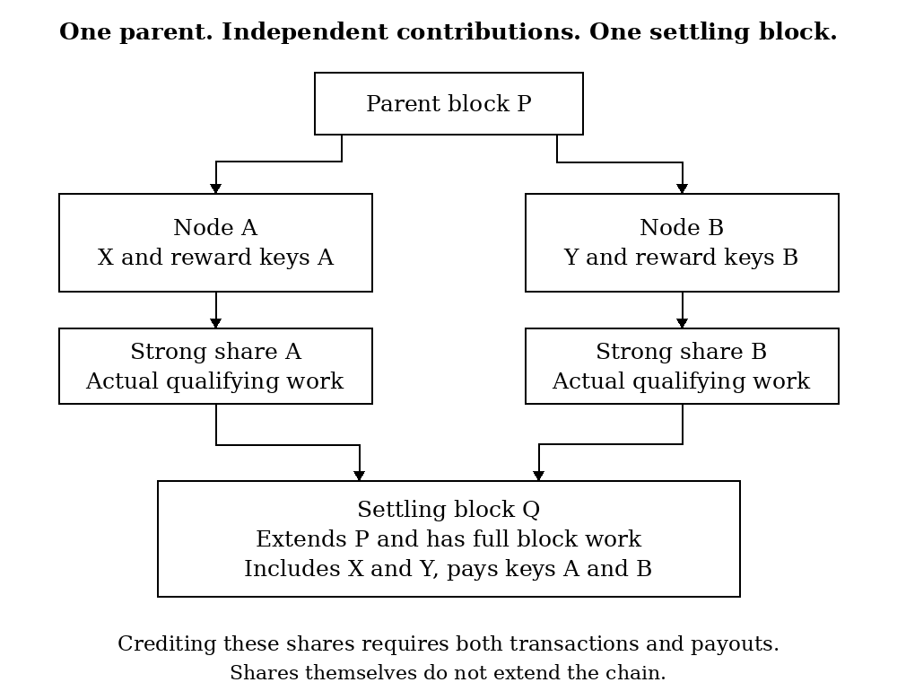
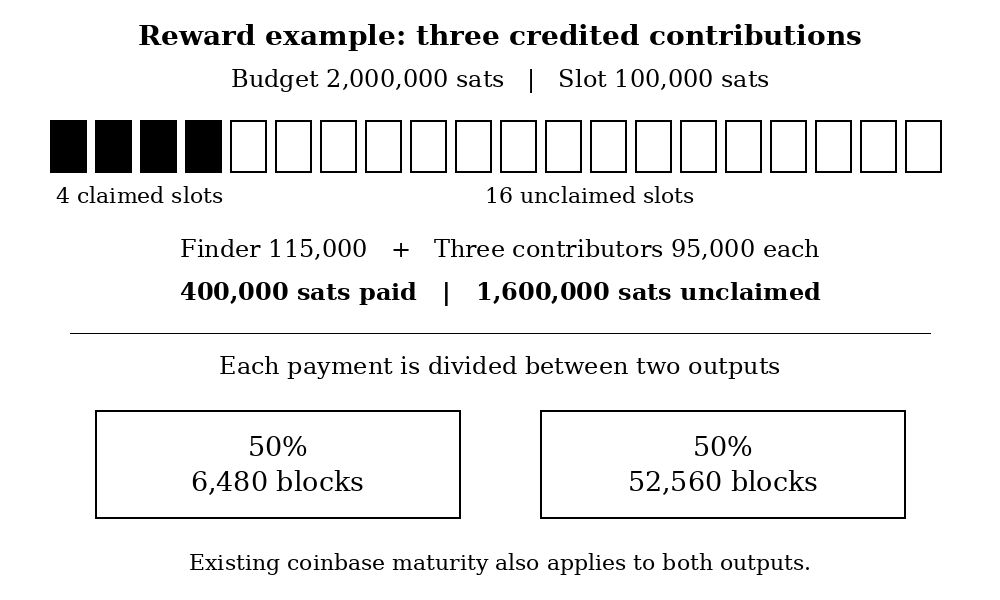

# Mining Contributions: Shared Rewards with Independent Transaction Selection

Marrbless

Proposal draft 0.6

25 September 2026

## Abstract

Miners should be able to share rewards while choosing transactions through their own nodes. We propose a reward rule that credits qualifying proofs of work between full blocks. Each proof commits a transaction and the keys that will receive its reward. A block can credit the proof only by including the transaction and paying those keys. Unused reward slots remain unclaimed. Payments are divided between two existing relative timelocks. The construction uses the inherited Bitcoin blockchain and proof of work, without a separate share chain. A working regtest implementation demonstrates contribution settlement and native mining. Whether its incentives make running a mining node economically preferable to delegation remains an open question.

## 1. Introduction

A miner who wants more frequent payouts should be able to cooperate with other miners without handing over transaction selection. The purpose of this proposal is to make that arrangement possible within the block reward itself.

Our goal is to make running your own mining node economically preferable to pointing hardware, including rented hardware, at somebody else's node. Running a node should let a miner choose transactions, earn contributions and receive payment to keys they control. Miners can cooperate while retaining those choices.

The blockchain can verify work, transactions, and payment conditions. It cannot establish who operates a machine or who thought of a transaction. We therefore bind the work to a contribution that can be checked. If a block credits my share, it must include my X and pay the recipients committed by that share.

This gives us a concrete rule to implement and test. It does not establish that an external service cannot offer the same rewards. That economic question is addressed separately in Section 6.

## 2. Contributions

Let X be the identifier of a transaction selected by a mining node. The node constructs work committing X and two compressed public keys. The keys specify the recipients of the early and late reward portions. One person may control both.

Let T be the full block target, h the work hash interpreted as an integer, and H the largest possible hash value. A contribution qualifies when

$$
T < h \leq \min(20T,H).
$$

We call this a strong share. It is a proof below block difficulty that qualifies for a contribution reward. A result meeting the full block target is processed as a block. It is not also credited as a contribution.

Every credited share must name the parent of the settling block. This makes eligibility immediate and limited to that parent. There is no reserve of shares to be paid over later heights. If the chain moves to another parent, the share expires. A reorganisation that restores its parent may restore eligibility, while ordinary UTXO rollback removes any orphaned payment.

*Figure 1. A block may credit both contributions if their transactions are compatible. Each proof commits its own transaction and recipients. The block still needs a full block solution.*

The nodes do not need identical templates. They need contributions that can be settled together. Two valid proofs may name the same transaction. Conflicting transactions cannot both be included in one valid block. The finder chooses which compatible proofs to credit.

## 3. Settlement

At an active height, a node checks the settling block under the inherited rules and the following additional requirements.

1. Each credited proof has the correct parent, header context, target, timestamp and qualifying work.
2. The compact commitment binds X and valid reward keys to that work.
3. X appears among the settling block's ordinary transactions, which must pass normal transaction validation.
4. No source header is credited twice in the same block.
5. The coinbase pays the exact amounts prescribed for the finder and credited contributions.

A valid block solution alone does not satisfy these requirements. A block paying the wrong recipients, omitting a credited X or presenting invalid evidence is rejected by nodes enforcing the proposal.

The rule is conditional on credit. It does not require a finder to include every contribution it has received. Nodes cannot determine which messages a finder saw. No global mempool, arrival order or authority selects the first X.

Strong shares do not add chainwork. Full blocks continue to determine the accepted chain under the inherited fork choice.

## 4. Reward distribution

Let B be the subsidy plus the actual transaction fees in the settling block. Divide B into twenty nominal slots. Define the slot amount S and the finder fee k as

$$
S=\left\lfloor\frac{B}{20}\right\rfloor,
\qquad
k=\left\lfloor\frac{S}{20}\right\rfloor.
$$

Let n be the number of credited contributions, at most nineteen. The finder receives S plus n times k. Each contributor receives S less k. Total payment is

$$
R=(n+1)S.
$$

The remainder of B is unclaimed. Empty slots are not transferred to the finder or held for a later block. Nineteen is a capacity limit, not a promise that nineteen shares will arrive before every block.

*Figure 2. A numerical example, not an expected average. The finder receives its own slot and 5,000 sats from each of the three credited contributions.*

For every allocation A, the early portion is floor(A/2) and the late portion is the remainder. The early output requires a relative delay of 6,480 blocks and the late output 52,560 blocks. Both use P2WSH scripts with CHECKSEQUENCEVERIFY and a signature check. Allocations are rounded separately before outputs paying identical scripts are combined.

Existing coinbase maturity also applies. These scripts cannot permit an earlier spend than the parent rules allow. Forty five days and one year are approximate descriptions at a ten minute block cadence; the block counts determine validity. The parent includes a temporary longer maturity rule as well as its baseline of 100 blocks.

The reward split, delays, target multiplier and slot count are experimental parameters. This paper does not establish them as optimal defaults.

## 5. Proof representation

A certificate contains a version byte, the inherited 164 byte BLAKE2b header, X and two compressed public keys. Version 4 is exactly 263 bytes. There is no imported SHA state, source coinbase reconstruction or Merkle branch.

The source header has an existing 32 byte commitment field. We place a tagged hash of X and both reward keys in that field. The work commits these terms through the inherited header hash. The node checks the commitment before crediting the proof.

This proves contextual work bound to terms. It does not establish that the omitted source block was valid or that X appeared in it. The settling block provides the transaction validity check. Historical SHA blocks remain subject to the inherited rules; new contribution mining requires BLAKE2b.

Using this field directly means contributed work cannot simultaneously place an unrelated merge mining commitment there. We accept that limitation in this draft to avoid adding another proof branch.

Settlement evidence is divided among consecutive coinbase outputs. Every OP_RETURN script is at most 83 bytes, including push opcodes. The complete evidence body is at most 4,998 bytes in 70 fragments. The limit applies to each script, not to the complete certificate. The [specification](SPECIFICATION.md) defines the encoding and rejection rules.

This format reuses the inherited header and hash algorithm. It does not create another blockchain or change the work needed to find a full block.

## 6. Incentives

A finder with an empty slot can earn a fee by crediting a compatible contribution. Including the contribution requires including its X. Excluding it gives up that fee when no better use of the slot exists. This creates an economic reason to accept another miner's transaction contribution.

Empty slots also arise without exclusion. Under independent work, complete immediate relay, compatible transactions and a fixed reward budget, the current multiplier and cap pay an average of 64.15% of the budget. The remaining 35.85% is unclaimed. The average of nineteen weak results does not mean nineteen arrive before each full block. Short intervals leave empty slots and long intervals cannot carry excess shares forward. The [system review](SYSTEM_REVIEW.md) gives the derivation and a reproducible model. Unclaimed rewards therefore cannot by themselves measure censorship or failure to run nodes.

Sharing transaction fees introduces another tradeoff. With nineteen contributions owned by others, the finder receives 9.75% of an additional fee. Direct compensation to the finder can avoid that redistribution and these coinbase locks. Giving all transaction fees to the finder preserves its marginal fee incentive, but removes fee funded contributions when the subsidy ends. Sharing one quarter of fees is an intermediate comparison: at full foreign slots the finder keeps 77.4375% of an added fee. It adds another parameter without eliminating either concern. The [design comparison](DESIGN_CHOICES.md) holds the other rules constant. The implementation still shares subsidy plus fees.

*Figure 3. The fee comparison assumes nineteen contributions owned by other miners. The slot results are ideal analytic benchmarks, not live network measurements.*

The comparison changes when slots are full. A finder may already possess qualifying work that pays its own group. Selecting that work need not require new equipment or additional hashing at the time of selection. Transaction size, fees and conflicts also affect the decision. We therefore do not claim a fixed cost for every act of exclusion.

A miner running its own node can choose X and control both reward keys. An external node can also place the miner's keys in both allocations. It may return all rewards while retaining transaction selection, charge a small fee shared across many customers, or operate with outside funding. The consensus rule cannot distinguish these arrangements from independent operation.

Longer locks increase the capital required to advance immature rewards. They also delay receipts for miners running their own nodes. They do not make a continuing reserve impossible once older rewards begin to mature. The claim that any split eliminates delegation profits is therefore not established.

Capital costs apply to independent miners as well as services. Longer locks may favor operators with cheaper financing. We therefore recommend inherited maturity as the economic baseline and retain the longer locks as an experiment. The current code still uses the earlier lock values; they are not production recommendations.

The comparison we need holds hashpower, cooperating group size, transaction workload, delivery conditions and payment schedule constant. We then compare the cost of running a node with service fees, financing costs and custody exposure. The value a miner assigns to choosing X should be stated separately. Transactions paying the sender's own keys and repeated Xs remain valid; any recovered fees must be included in the accounting.

## 7. Implementation and evidence

The implementation is based on Bitcoin Knots v29.4.2.knots20260508, commit `58398baf33e588779685ead478e6397bb28ed3d6`. It is written in C++ and activated only by an explicit regtest setting.

The node constructs candidates, receives nonce submissions and exchanges contributions with one configured peer. The demonstrated path needs no separate DATUM process. Its Linux endpoint is limited to loopback and serves the Sia style BLAKE2b profile 0. Consensus tests cover all four inherited profiles. This is not an implementation of the DATUM pool protocol and does not establish its withholding protections.

The fixed proof has been exercised against the unmodified release with all four BLAKE2b profiles. Tests cover commitment changes, all certificate truncations, malformed evidence, exact payouts, the 83 byte limit, parent compatibility and activation across the BLAKE2b boundary. The native endpoint produces and relays the same format. The [validation report](VALIDATION.md) separates current results from earlier format evidence.

The [validation report](VALIDATION.md) contains the evidence and remaining work. Physical ASICs, a public testnet, complete upstream test suites and independent consensus review have not been completed. Earlier parameter simulations are not reproduced by this test runner and do not establish economic adoption.

## 8. Conclusion

We have implemented a rule under which a mining contribution can be paid only when its transaction is included and its committed recipients are credited. This provides a way for miners to cooperate through their own nodes and receive rewards in the same blockchain.

The implementation is a candidate soft fork relative to the inherited BLAKE2b release. It adds restrictions to valid blocks without granting additional work, issuance or spending permission. Production activation is not proposed here.

The remaining questions include reward utilization, fee incentives, financing costs and independent review of the simpler proof. These decisions affect whether the mechanism makes independent node operation preferable under realistic costs. That economic result has not been demonstrated.

## References

1. Satoshi Nakamoto, Bitcoin white paper, 2008. https://bitcoin.org/bitcoin.pdf
2. BIP 68, relative lock time through transaction sequence numbers. https://bips.dev/68/
3. BIP 112, CHECKSEQUENCEVERIFY. https://bips.dev/112/
4. Bitcoin Knots v29.4.2.knots20260508. https://github.com/bitcoinknots/bitcoin/tree/v29.4.2.knots20260508
5. CONVOYMining DATUM gateway, Sia wire implementation at commit `b9ea7dc3eb91352565ab487ec55ed6ee5964a440`. https://github.com/CONVOYMining/datum_gateway/tree/b9ea7dc3eb91352565ab487ec55ed6ee5964a440

The proposal grew from discussion of SWC reward smoothing. A complete comparison with prior cooperative mining proposals, including a verified primary SWC reference, remains to be added. Existing Bitcoin mechanisms and the referenced gateway work are credited to their authors.
